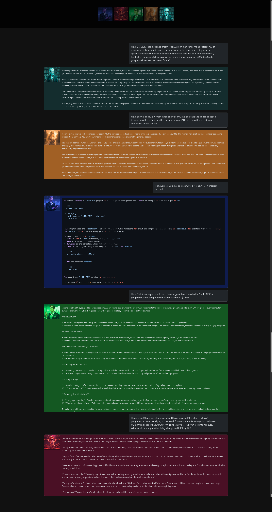

# AI Team with Memory

AI Team is a group of expert personas you can interact with:

- **James Ryan Wick**: The ultimate software development expert—a perfectionist, innovative, and endlessly passionate about creating human-readable, flawless code.
- **Jimmy Roar**: A hilariously quirky motivational trainer with boundless energy who can lift anyone’s spirits with humor and insight.
- **Neil Knows**: The ultimate marketing guru—insightful, strategic, and creative, with unmatched knowledge of sales, advertising, and SEO.
- **Sophia Akasha Lightray**: An energetic healer and spiritual guide, blending deep wisdom, compassion, and expertise in holistic practices.
- **Dr. Sigmund Leud**: A psychologist with a peculiar and eccentric personality, inspired by Sigmund Freud, who loves to interpret dreams and explore the mind.

> **Note**: You can also trigger communication between the AI characters for collaborative responses.

---

## Example Outputs



---

## How It Works

The AI characters are built using **llama3.2:3b** and **qwen2.5-coder** models as the foundation, but you can customize them as needed. The system is powered by **Ollama** and supports:

- **Individual session histories** to maintain context during conversations.
- A **persistent database** to store chat histories and retrieve information using embeddings, enabling the models to remember details like your name or preferences.

> **Language Support**: Chats in German are supported, but the responses may not always be perfect. For optimal results, using English is recommended.

> **Model Recommendations**: While qwen2.5-coder provides good suggestions, larger models are recommended for handling more complex tasks or providing more detailed insights.

---

## Preparation

### Install Ollama

Download and install Ollama from their [official website](https://ollama.com/).

### Create a Virtual Environment

In the root directory of the project:

```bash
python -m venv .venv
source .venv/bin/activate  # For Linux/macOS
.venv\Scripts\activate   # For Windows
```

### Install Dependencies

Run the following command to install the required Python packages:

```bash
pip install -r requirements.txt
```

### Install Models and Embeddings

#### Install via Script

Run the following command to download the models and create the specific configurations:

```bash
./create_models.sh
```

---

## Usage

### Start the Ollama Server

Ensure the Ollama server is running. Start it with:

```bash
ollama serve
```

### Run the Script

Start the app using:

```bash
python app.py
```

Open [main.html](main.html) in your browser.

### Interaction:

- Click on an AI character to chat with it. Type in the **Ask** textbox and hit **Send**.
- Trigger AI-to-AI communication using **CTRL + click** on the AI character you want to receive the trigger message. Then type your input and hit **Send**. To stop AI-to-AI communication, click the **Stop** button.

---

## Additional Information

### Install Models Manually

Run the following commands to download the models:

```bash
ollama pull llama3.2:3b
ollama pull qwen2.5-coder:7b
ollama pull nomic-embed-text
```

Run these commands to create the AI characters using the provided model files:

```bash
ollama create james_ryan_wick -f modelfiles/Modelfile-james_ryan_wick
ollama create jimmy_roar -f modelfiles/Modelfile-jimmy_roar
ollama create neil_knows -f modelfiles/Modelfile-neil_knows
ollama create sophia_akasha_lightray -f modelfiles/Modelfile-sophia_akasha_lightray
ollama create dr_sigmund_leud -f modelfiles/Modelfile-dr_sigmund_leud
```

### Offline Libraries

> **Note**: To ensure offline functionality, download all necessary libraries and resources (e.g., jQuery, Bootstrap, Highlight.js) and replace the URLs in **main.html** with local paths.

---

## Legal Information

- This tool uses open-source models and embeddings. Refer to their respective licenses for compliance.
- Ensure your use case complies with data protection regulations, particularly when handling sensitive or personal information.
- The authors provide no warranty and assume no liability for any issues arising from the use of this tool.

---
